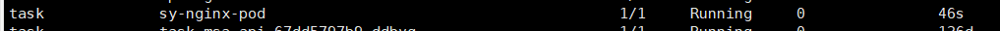
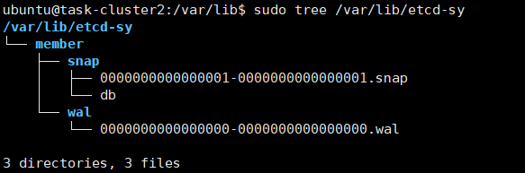
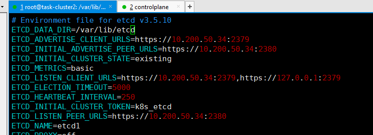
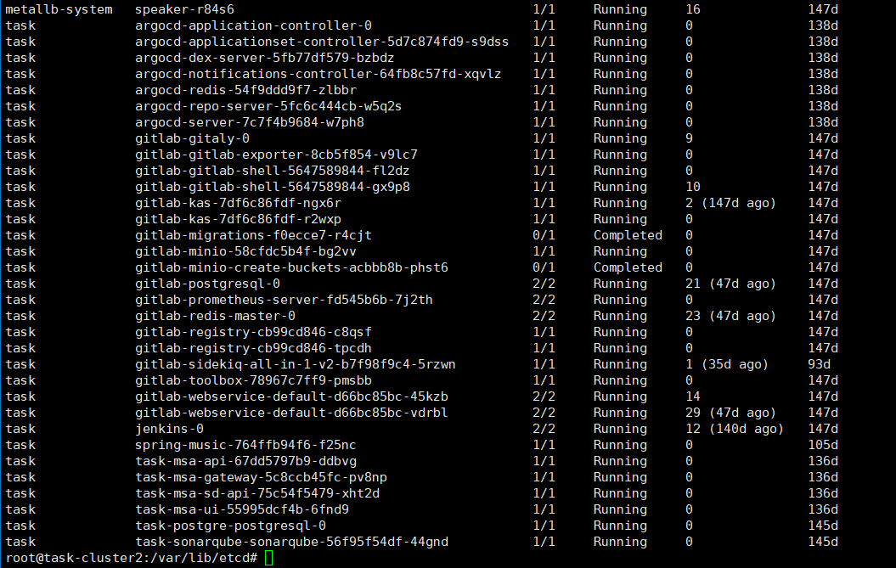
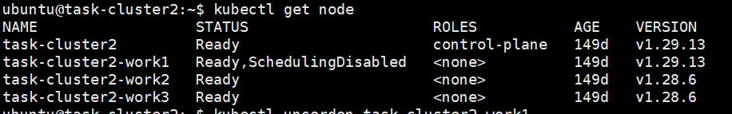
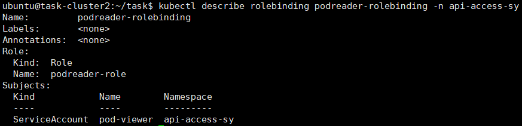
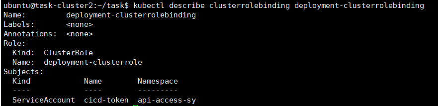

# sub-task : Cluster Installation & Configuration 산출물

[1. ETCD 백업 & 복구](#1-etcd-백업--복구) 
- [1.1. 백업](#11-백업) 
- [1.2. nginx pod 배포](#12-nginx-pod-배포) 
- [1.3. 복구](#13-복구) 
- [1.3. 복구 확인](#14-복구-확인) 

[2. Kubernets Upgrade](#2-kubernets-upgrade) 
- [2.1. 개념 정리](#21-개념-정리) 
- [2.2. 마스터 노드 업그레이드](#22-마스터-노드-업그레이드) 
- [2.3. 워커 노드1 업그레이드](#23-워커-노드1-업그레이드) 
- [2.4. 결과 확인](#24-결과-확인) 

[3. RBAC(ServiceAccount, Role, RoleBinding)](#3-rbacserviceaccount-role-rolebinding) 
- [3.1. NameSpace 생성](#31-namespace-생성) 
- [3.2. ServiceAccount 생성](#32-serviceaccount-생성) 
- [3.3. Role 생성](#33-role-생성) 
- [3.4. RoleBinding 생성](#34-rolebinding-생성) 
- [3.5. 생성 확인](#35-생성-확인) 

[4. RBAC(ServiceAccount, ClusterRole, ClusterRoleBinding)](#4-rbacserviceaccount-clusterrole-clusterrolebinding) 
- [4.1. ServiceAccount 생성](#41-serviceaccount-생성) 
- [4.2. ClusterRole 생성](#42-clusterrole-생성) 
- [4.3. ClusterRoleBinding 생성](#43-clusterrolebinding-생성) 
- [4.4. 생성 확인](#44-생성-확인) 

# 1. ETCD 백업 & 복구

## 1.1. 백업

    ETCDCTL_API=3 etcdctl --endpoints=https://127.0.0.1:2379 --cacert=/etc/ssl/etcd/ssl/ca.pem --cert=/etc/ssl/etcd/ssl/member-task-cluster2.pem --key=/etc/ssl/etcd/ssl/member-task-cluster2-key.pem snapshot save /data/etcd-snapshot-sy250121.db

## 1.2. nginx pod 배포

## 1.3. 복구

    sudo ETCDCTL_API=3 etcdctl --data-dir /var/lib/etcd-sy snapshot restore /data/etcd-snapshot-sy250121.db

    sudo tree /var/lib/etcd-sy

### /etc/etcd.env의 ETCD_DATA_DIR를 백업 데이터의 경로로 변경.

    systemctl restart etcd

## 1.4. 복구 확인

# 2. Kubernets Upgrade

## 2.1. 개념 정리

#### kubeadm 
실행 가능한 최소의 클러스터를 가장 빠르게 구축하기 위한 기능을 제공하는 도구.

#### kubelet
각 노드에서 실행되는 기본 node agent로 마스터-노드 간의 중간다리 역할.

 - api-server와 통신하며 container runtime을 사용해 podspec에 기술된 컨테이너들이 정상적으로 작동하도록 함.
 - 노드의 리소스 사용량을 모니터링하여 마스터에 보고. 클러스터의 스케줄링 결정에 사용됨.
 - 노드가 비정상 종료되었을 때 자동으로 복구. 노드의 가용성 유지, 노드 장애 시 클러스터의 안정성 보장.

#### kubectl
쿠버네티스 api를 사용하여 클러스터의 컨트롤 플레인과 통신하기 위한 cli 도구.

## 2.2. 마스터 노드 업그레이드

### 2.2.1. 기존 버전 정보 확인
    kubectl version --output=yaml

### 2.2.2. package repository 변경
    curl -fsSL https://pkgs.k8s.io/core:/stable:/v1.29/deb/Release.key | sudo gpg --dearmor -o /etc/apt/keyrings/kubernetes-apt-keyring.gpg
    
    echo "deb [signed-by=/etc/apt/keyrings/kubernetes-apt-keyring.gpg] https://pkgs.k8s.io/core:/stable:/v1.29/deb/ /" | sudo tee /etc/apt/sources.list.d/kubernetes.list
    
    sudo apt-get update
    
    sudo apt-cache madison kubeadm

### 2.2.3. 업그레이드
    sudo apt-mark unhold kubeadm && sudo apt-get update && sudo apt-get install -y kubeadm='1.29.13-*' && sudo apt-mark hold kubeadm
    
    sudo mv /usr/bin/kubeadm /usr/local/bin/kubeadm
    
    sudo kubeadm upgrade plan
    
    sudo kubeadm upgrade apply v1.29.13
    
    sudo systemctl restart kubelet

## 2.3. 워커 노드1 업그레이드

### 2.3.1. 업그레이드
    sudo apt-mark unhold kubeadm && sudo apt-get update && sudo apt-get install -y kubeadm='1.29.13-*' && sudo apt-mark hold kubeadm

    sudo mv /usr/bin/kubeadm /usr/local/bin/kubeadm

    sudo kubeadm upgrade node
    

### 2.3.2. node drain
    kubectl drain task-cluster2-work1 --ignore-daemonsets --delete-emptydir-data

### 2.3.3. kubelet & kubectl 업그레이드
    sudo apt-mark unhold kubelet kubectl && sudo apt-get update && sudo apt-get install -y kubelet='1.29.13-*' kubectl='1.29.13-*' && sudo apt-mark hold kubelet kubectl

    sudo systemctl daemon-reload
    sudo systemctl restart kubelet

### 2.3.4. uncordon
    kubectl uncordon task-cluster2-work1

## 2.4. 결과 확인

# 3. RBAC(ServiceAccount, Role, RoleBinding)

## 3.1. namespace 생성

    kubectl create ns api-access-sy

## 3.2. serviceaccount 생성

    kubectl create sa pod-viewer -n api-access-sy

## 3.3. role 생성
    kubectl create role podreader-role --verb=get,list,watch --resource=pods --namespace=api-access-sy

## 3.4. rolebinding 생성
    kubectl create rolebinding podreader-rolebinding --role=podreader-role --serviceaccount=api-access-sy:pod-viewer -n api-access-sy

## 3.5. 생성 확인

# 4. RBAC(ServiceAccount, ClusterRole, ClusterRoleBinding)

## 4.1. serviceaccount 생성
    kubectl create sa cicd-token -n api-access-sy

## 4.2. clusterrole 생성
    kubectl create clusterrole deployment-clusterrole --verb=create --resource=Deployment,Statefulset,Daemonset

## 4.3. clusterrolebinding 생성
    kubectl create clusterrolebinding deployment-clusterrolebinding --clusterrole=deployment-clusterrole --serviceaccount=api-access-sy:cicd-token

## 4.4. 생성 확인

