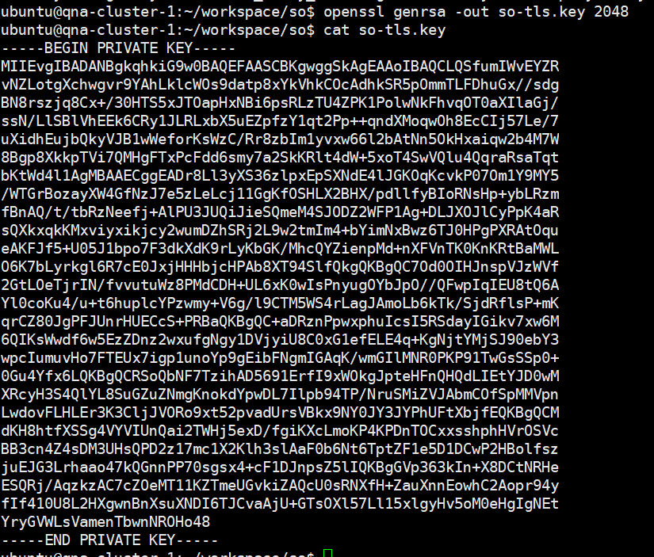

# sub-task : Workloads and Scheduling (2) 산출물

[1. Deployment 및 scaling](#1-deployment) 
- [1.1. Deployment](#11-deployment) 
- [1.2. Scale-in / Scale-out](#12-scale-in--scale-out) 
- [1.3. 실습](#13-실습) 

[2. Rolling Update & Roll back](#2-rolling-update--roll-back) 
- [2.1. Rolling Update](#21-rolling-update) 
- [2.2. Rollback](#22-rollback) 
- [2.3. 명령 예시](#23-명령-예시) 
- [2.4. 실습](#24-실습) 

[3. Node management](#3-node-management) 
- [3.1. kubectl drain option](#31-kubectl-drain-option) 
- [3.2. 실습1](#32-실습1) 
- [3.3. 실습2](#33-실습2) 

[4. Pod Scheduling](#4-pod-scheduling) 
- [4.1. Label / Selector](#41-label--selector) 
- [4.2. 실습1](#42-실습1) 
- [4.3. Taint / Tolerations](#43-taint--tolerations) 

[5. ConfigMap & Secret](#5-configmap--secret) 
- [5.1. Configmap option](#51-configmap-option) 
- [5.2. Secret option](#52-secret-option) 
- [5.3. 실습1](#53-실습1) 
- [5.4. 실습2](#54-실습2) 

# 1. Deployment

## 1.1. Deployment

컨테이너 애플리케이션을 배포하고 관리하는 역할을 하는 오브젝트로 deployment 생성 시 replicaset을 생성하여 pod를 관리함. 

### 1.1.1. Deployment 사용 이유

- 애플리케이션 버전이 변경될 경우 새로 replicaset을 생성한 후 기존 replicaset 의 pod 갯수를 점차적으로 줄여 rollout 가능.
- 애플리케이션 업데이트 시 replicaset의 변경 사항을 저장하는 revision을 남겨 문제가 발생하면 rollback이 가능.

## 1.2. Scale-in / Scale-out

### 1.2.1. Scale-out

서버의 스펙을 상승시키는 scale-up과 다르게 서버 대수를 증가시키는 방법(horizontal scaling)으로 단계적으로 확장이 가능하며 병목현상의 발생을 줄일 수 있음.    

### 1.2.2. Scale-in

필요없어진 서버 자원을 다시 회수하는 작업을 의미.

## 1.3. 실습

요구사항 )
>kubectl 명령을 통해 webserver 라는 이름으로 yaml 을 생성하고, kubectl 명령을 통해 webserver Deployment의 pod 수를 3개로 확장하세요.
>
> kind: deployment
> Name: webserver
> 2 replicas
> label: app_env_stage=dev
> container name: webserver
> container image: nginx:1.14

### 1.3.1. deployment 배포

deployment.yaml )

    apiVersion: apps/v1
    kind: Deployment
    metadata:
    name: webserver
    spec:
    replicas: 2
    selector:
        matchLabels:
        app_env_stage: dev
    template:
        metadata:
        labels:
            app_env_stage: dev
        spec:
        containers:
        - name: webserver
            image: nginx:1.14
            ports:
            - containerPort: 80

##### 명령어를 사용해서 배포하는 것을 권장!
kubectl create deployment webserver --image=nginx:1.14 --replicas=2 -n so-task -o yaml >test.yml

하지만 label은 명령어를 사용해서 추가하면 deployment의 label만 추가됨. 
    kubectl label deployment webserver app_env_stage=dev -n so-task

따라서 그냥 파일을 수정하는 것이 나을듯.

### 1.3.2. replicaset 확장

    kubectl scale deployment/webserver -n so-task --replicas=3

결과 )

# 2. Rolling Update & Roll back

## 2.1. Rolling Update

rolling update는 쿠버네티스에서 지원하는 무중단 배포* 전략 중 하나로 신규 deployment의 디폴트 설정. 
애플리케이션의 신버전을 배포할 때 새 버전 인스턴스를 하나씩 늘려가고 기존 버전의 인스턴스를 하나씩 줄여나가는 배포 방식.

*무중단 배포 : 서비스가 중단되지 않도록 배포되는 기술

## 2.2. Rollback

배포 후 문제가 발생할 경우 원하는 리비전*을 선택하여 이전 상태로 돌아갈 수 있음.

*deployment의 변경 이력을 추적하는 용도로 deployment가 업데이트되면서 replicaset이 생성될 때 리비전 번호가 자동으로 증가함.

## 2.3. 명령 예시

### 2.3.1. Rolling Update

    kubectl rollout restart deployment msa-sample-ui -n openlab

### 2.3.2. Rollback

    //history 확인
    kubectl rollout history deployment/msa-sample-ui -n openlab

    //rollback
    kubectl rollout undo deployment/msa-sample-ui -n openlab --to-revision=3

## 2.4. 실습

요구사항 )
>Deployment를 이용해 nginx 파드를 3개 배포한 다음 컨테이너 이미지 버전을 rolling update하고 update record를 기록합니다. 마지막으로 history 확인 후 컨테이너 이미지를 previous version으로 roll back 합니다.
>
> name: webserver
> Image : nginx
> Image version: 1.16
> update image version: 1.17
> label: app=payment, environment=production

### 2.4.1. deployment 배포

deployment.yml )

    apiVersion: apps/v1
    kind: Deployment
    metadata:
    name: webserver
    labels:
        app: payment
        environment: production
    spec:
    replicas: 3
    selector:
        matchLabels:
        app: payment
        environment: production
    template:
        metadata:
        labels:
            app: payment
            environment: production
        spec:
        containers:
        - name: nginx
            image: nginx:1.16
            ports:
            - containerPort: 80

### 2.4.2. rolling update 실행

    kubectl set image deployment/webserver -n so-task nginx=nginx:1.17

### 2.4.3. rollback 실행

    //revision history 조회
    kubectl rollout history deployment/webserver -n so-task

    //rollback
    kubectl rollout undo deployment/webserver -n so-task --to-revision=1

    

### 2.4.4. 기타

##### rollback이 완료되면 기존 revision 번호가 다시 할당됨.

##### revision change-cause 추가

변경 후 deployment에 annotation을 추가해줘야 history의 change-cause에 반영이 됨.

    kubectl annotate deployment/webserver -n so-task kubernetes.io/change-cause="image update to 1.17"

# 3. Node management

## 3.1. kubectl drain option

### 3.1.1. dry-run

명령 실행 시 사용하면 명령을 실제로 실행하지 않고 결과값만 보여주는 옵션.

- none : 옵션 사용하지 않는 것과 동일한 효과.

- client : 실제 요청을 하지 않고 요청할 object만 보여줌. 

- server : api서버에 실제로 요청을 하고 api 서버가 예상되는 결과를 반환하지만 실제 변경 사항이 resource에 반영되지 않음. 
서버 유효성 검사, 기본값 설정 등 실제 명령 처리의 라이프사이클 시뮬레이션이 가능.

### 3.1.2. delete-emptydir-data

emptyDir를 사용하는 pod가 존재하더라도 계속 진행함(pod 제거 시 데이터도 제거됨).

참고* : delete-local-data는 deprecated되어 delete-emptydir-data로 대체됨.

### 3.1.3. ignore-daemonsets

daemonset이 관리하는 파드는 drain 과정에서 삭제되지 않고 에러가 발생하기 때문에 
무시하도록 설정.

## 3.2. 실습1

요구사항 )
>특정 노드를 스케줄링 불가능하게 설정하고, 해당 노드에서 실행 중인 모든 Pod을 다른 node로 reschedule 하세요.

    //스케줄링 막기
    kubectl cordon qna-cluster-3

    //drain
    kubectl drain qna-cluster-3 --ignore-daemonsets --delete-emptydir-data

## 3.3. 실습2

요구사항 )
>Ready 상태(NoSchedule로 taint된 node는 제외)인 node를 찾아 그 수를 notaint_ready_node.log 에 기록하세요.

    kubectl get nodes --no-headers | awk '$2 == "Ready" {print $1}' | wc -l > notaint_ready_node.log

# 4. Pod Scheduling

## 4.1. Label / Selector

### 4.1.1. Label

label은 객체 생성 시 객체를 구분하기 위해 지정하는 임의의 값으로 key-value 형식.

### 4.1.2. Selector

label을 이용해 쿠버네티스 리소스를 필터링하는 query

### 4.1.3. 기타

##### node label 사용 이유

- node에 label을 사용하는 이유는 GPU가 있는 노드에만 파드를 배치하거나, 특정 지역에 있는 노드에만 배치하는 등의 특정 노드로 파드를 배치하기 위해.
- worker, master 노드 구분이나 type=high-memory 같이 노드가 어떤 역할을 수행하는지 구분할 수 있음.

##### msa-sample 배포 시 통신 에러 발생 이유

api, sd-api, gateway, ui 모두 동일한 label을 가지고 있는데 service의 selector와 매칭되는 label이 있는 pod들을 endpoint로 등록함. 요청이 들어오면 로드밸런싱이 되면서 4번에 한번 정도만 해당 파드로 정상 통신이 됨.

## 4.2. 실습1

요구사항 )
>Label 및 selector 를 활용하여 다음 조건의 POD을 특정 NODE에 배포 될 수 있도록 구성하세요.
>
> node label: sub-task-node
> pod name: webserver
> pod image: nginx
> node selector: sub-task-node

    //node label 확인
    kubectl get nodes --show-labels

    //node label 추가
    kubectl label node qna-cluster-3 task=sub-task-node

    //pod 배포
    apiVersion: v1
    kind: Pod
    metadata:
    name: webserver
    spec:
    containers:
    - name: nginx
        image: nginx:1.17
    nodeSelector:
        task: sub-task-node

    

## 4.3. Taint / Tolerations

### 4.3.1. Taint

노드마다 설정 가능한 pod 배치 전략으로 주로 특정 node에 특정 pod만 실행할 수 있도록 역할을 제한하기 위한 목적으로 사용됨.

    kubectl taint node {nodename} {key}={value}:{option}

##### cordon과 차이점

cordon은 기존 파드는 정상적으로 실행되며 새로운 파드의 배포를 막는 명령으로 주로 유지보수나 점검을 위해 일시적으로 노드를 배제할 때 사용하는 반면, taints는 effect 값에 따라 기존 파드도 다른 노드로 재배치될 수 있으며 주로 특정 조건을 만족하는 파드만 허용하고자 할 때 사용.

### 4.3.2. Tolerations

taint 설정이 되어 있더라도 taint에 부합하는 key:value 값을 tolerations로 지정하면 해당 노드에 스케줄 가능함.

# 5. ConfigMap & Secret

## 5.1. Configmap option

    //명령어 형식
    kubectl create configmap NAME [--from-file=[key=]source] [--from-literal=key1=value1] [--dry-run=server|client|none]

### 5.1.1. from-file

명령형(imperative) 방식으로 파일에 정의된 내용을 가져와서 configmap을 생성.

### 5.1.2. from-literal

선언형(declarative) 생성 방식으로 커맨드 실행 시 키-값 형태로 환경변수를 전달. 

    kubectl create configmap app-config --from-literal=APP_COLOR=blue --from-literal=APP_MODE=prod
### 5.1.3. validate

configmap의 구조와 형식이 쿠버네티스 스키마에 맞는지 검사하는 옵션. 

## 5.2. Secret option

### 5.2.1. docker-registry

docker registry 인증에 필요한 신원 타입

    kubectl create secret docker-registry NAME --docker-username=user --docker-password=password --docker-email=email [--docker-server=string] [--from-file=[key=]source] [--dry-run=server|client|none]

### 5.2.2. generic

일반 파일이나 디렉토리, 문자열 상수로 생성

    kubectl create generic NAME [--type=string] [--from-file=[key=]source] [--from-literal=key1=value1] [--dry-run=server|client|none]

### 5.2.3. tls

public/private 키페어를 통해 tls 시크릿을 생성

        kubectl create secret tls NAME --cert=path/to/cert/file --key=path/to/key/file [--dry-run=server|client|none]

- cert: 인증서 파일의 경로
- key: 키 파일의 경로

## 5.3. 실습1

요구사항 )
>openSSL을 이용하여 임의의 TLS를 생성하여 Secret으로 생성하세요.

### 5.3.1. private key 생성
    
    openssl genrsa -out so-tls.key 2048

### 5.3.2. csr 생성

CSR(certificate signing request)는 인증서를 발급받기 위한 요청서로 공개키와 함께 인증서에 포함될 정보(도메인 이름, 조직명 등)이 포함됨.

    openssl req -new -key so-tls.key -out so-csr.csr    

### 5.3.3. 인증서 생성

csr을 이용해 개인키로 서명한 자체 서명 인증서 생성. 공개키와 신원 정보가 포함됨.

    openssl x509 -req -days 365 -in so-csr.csr -signkey so-tls.key -out so-tls.crt

### 5.3.4. tls secret 생성

    kubectl create secret tls so-tls-secret -n so-task --cert=so-tls.crt --key so-tls.key

## 5.4. 실습2

요구사항 )
>아래의 변수를 configMap 으로 등록한 후 nginx 컨테이너에 환경변수로 할당하세요. 다음, 컨테이너에 접근하여 configmap 환경변수와 secret 을 출력하세요.
>
> DBNAME: mysql
> USER: admin

### 5.4.1. configmap 생성

    kubectl create configmap so-config -n so-task --from-literal=DB_NAME=mysql --from-literal=USER=admin

### 5.4.2. deployment 배포

tls secret을 추가하는 방법은 크게 두가지가 있는데 

1. 환경변수로 넘겨줌

2. volume으로 바인딩

tls 인증서는 파일로 사용되는 경우가 많아 볼륨 마운트 방식이 일반적으로 사용됨. 

    apiVersion: apps/v1
    kind: Deployment
    metadata:
    name: tls-test
    spec:
    selector:
        matchLabels:
        app: nginx
    template:
        metadata:
        labels:
            app: nginx
        spec:
        containers:
        - name: webserver
            image: nginx:1.16
            ports:
            - containerPort: 80
            envFrom:
            - configMapRef:
                name: so-config
            env:  // 방법1. 환경변수 추가
            - name: TLS_CERT
            valueFrom:
                secretKeyRef:
                name: so-tls-secret
                key: tls.crt
            - name: TLS_KEY
            valueFrom:
                secretKeyRef:
                name: so-tls-secret
                key: tls.key
        volumes:  // 방법2. 볼륨 마운트
        - name: tls-volume
            secret:
            secretName: so-tls-secret
                

### 5.4.3. 환경변수 적용 확인

    kubectl exec -it tls-test-8dd698b58-f7vkl -n so-task -- env

