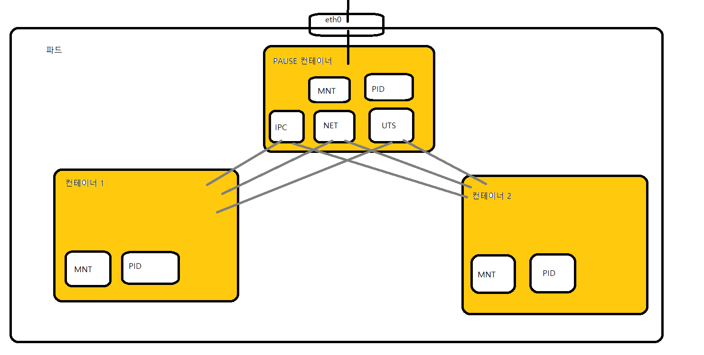
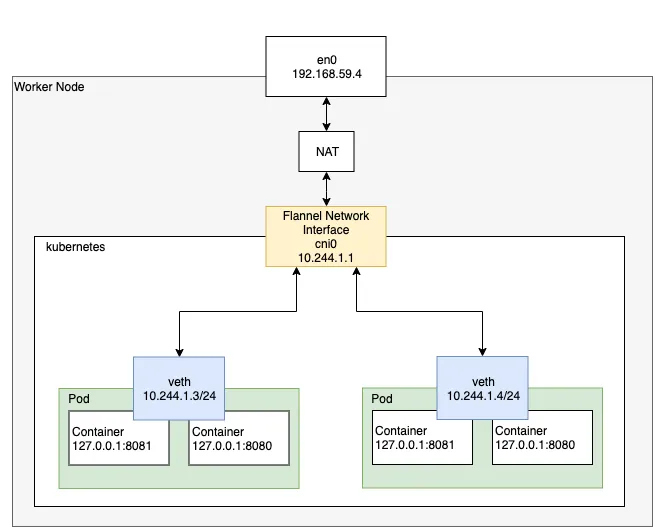
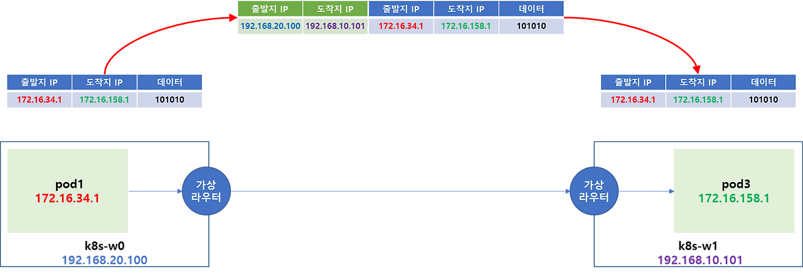
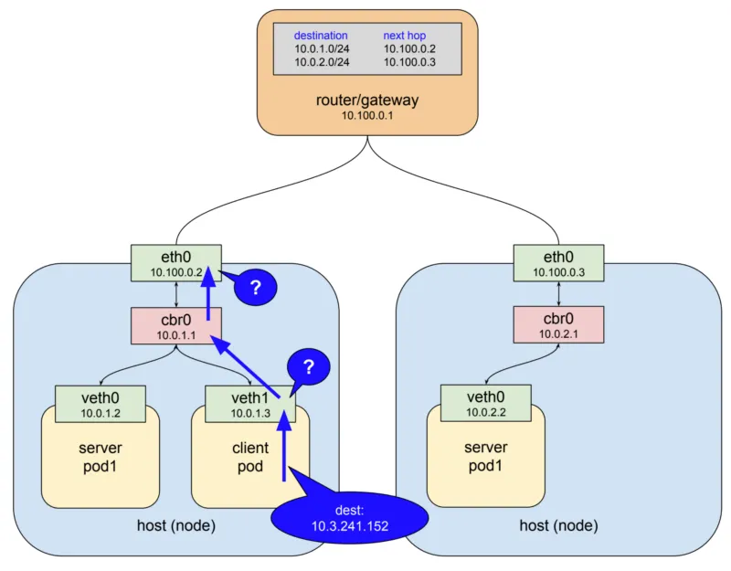

# sub-task : Service and Networking 산출물

[1. Kubernetes Network 동작 원리](#1-pod) 
- [1.1. Pod Network 구조](#11-pod란) 
- [1.2. Service Network 구조](#12-yaml-생성) 
- [1.3. Ingress Network](#13-pod-배포) 
- [1.4. kube-proxy 역할](#14-pod-로그-추출) 
[2. Service](#2-static-pod) 
- [2.1. Service Type 개념](#21-static-pod-개념) 
- [2.2. Servie 생성](#22-static-pod-배포) 
- [2.3. Named Service 구성](#23-static-pod-삭제) 
[3. Network Policy](#3-multi-container-pod) 
- [3.1. Selectors](#31-컨테이너와-pod의-차이점) 
- [3.2. 접근 제어](#32-pod-배포) 
[4. Ingress](#4-streaming-sidecar-container) 
- [4.1. Ingress 개념](#41-sidecar-container란) 
- [4.2. Ingress 구성](#42-sidecar-container-배포) 
[5. DNS](#4-streaming-sidecar-container) 
- [4.1. DNS 개념](#41-sidecar-container란) 
- [4.2. DNS 구성](#42-sidecar-container-배포) 

# 1. Kubernetes Network 동작 원리

## 1-1. Pod Network 구조를 이해하고 내용을 간략히 작성하세요.

### 파드 내부 통신

도커에서는 원래 컨테이너 별로 각각의 veth를 가짐. 근데 쿠버네티스에서는 pause container를 통해 한 파드의 컨테이너들이 동일한 네트워크 인터페이스(veth0)안에서 생성되어 로컬호스트로 통신이 가능하도록 함. (pause container가 부모 컨테이너로 네임스페이스 상속하는 형태)

### 동일 노드 파드간 통신

각 pod는 CNI로 구성된 네트워크 인터페이스를 통하여 고유한 IP주소로 서로 통신할 수 있음.

예를 들어, 왼쪽 파드에서 오른쪽 파드로 통신을 하려고 할 때,

오가 같은 네트워크 네임스페이스의 컨테이너가 아니므로(같은 파드 내 컨테이너가 아님) eth0으로 패킷 전달 -> veth pair로 연결된 노드의 root network namespace로 전달됨. -> bridge로 패킷이 전달되면 -> broadcast가 전송되어 오의 ip 주소를 질의?하게 됨. -> 오 pod 인터페이스의 mac 주소가 전달됨 -> iptable에 저장되면 조회하여 패킷을 오 pod로 전달.

### 다른 노드 파드간 통신

pod의 네트워크 정보를 node에서 encapsulation 과정을 거쳐 목적지 node로 전달함(overlay 방식*).

예를 들어 pod1에서 pod3으로 통신이 발생하면 pod1에서 출발할 때의 패킷은 출발지, 목적지 ip가 각각 pod1, pod3의 주소지만, 노드에서 터널을 거치면서 물리적 경로의 인터페이스 정보가 추가됨. 목적지 노드에서 출발지 목적지 ip를 제거하면 pod3에서 pod의 정보만 남은 패킷을 받게됨.

##### ** 오버레이 네트워크

물리적인 네트워크 위에 가상 네트워크를 구축하여 서로 다른 노드에 있는 pod 들이 같은 네트워크에 있는 것처럼 통신할 수 있게 해주는 기술로 CNI 플러그인을 통해 적용됨.

## 1-2. Service Network 구조를 이해하고 내용을 간략히 작성하세요.

pod는 끊임없이 삭제되거나 재생성되기 때문에 서비스(pod)의 앞단에 proxy를 두고 proxy로 연결을 하면 서버들의 목록을 관리하며 현재 동작하는 서버에게 트래픽을 전달.

1. 스스로 내구성이 있어야하며 장애에 대응이 가능해야 함.
2. 트래픽을 전달할 서버 리스트를 보유하고 해당 서버가 정상적으로 동작하는지 확인할 수 있어야 함.

service는 각 pod로 트래픽을 포워딩 해주는 프록시 역할이며 selector를 사용해 트래픽을 전달받을 pod를 결정함.

위와 같은 구조로 파드가 배포되어 있고, 각 노드에 있는 server pod1의 라벨을 셀렉터를 가진 서비스가 존재한다고 할 때 http 요청을 하는 과정은

1. client 파드가 service 이름의 DNS 이름으로 http 요청을 함.
2. coredns가 해당 이름을 serviceIP로 매핑시켜줌.
3. 해당 ip로 요청을 보냄.

##### ** IP네트워크(layer3)는 해당 호스트에서 목적지를 찾지 못하면 상위 게이트웨이로 패킷을 보내는 형태로 동작하게 됨.