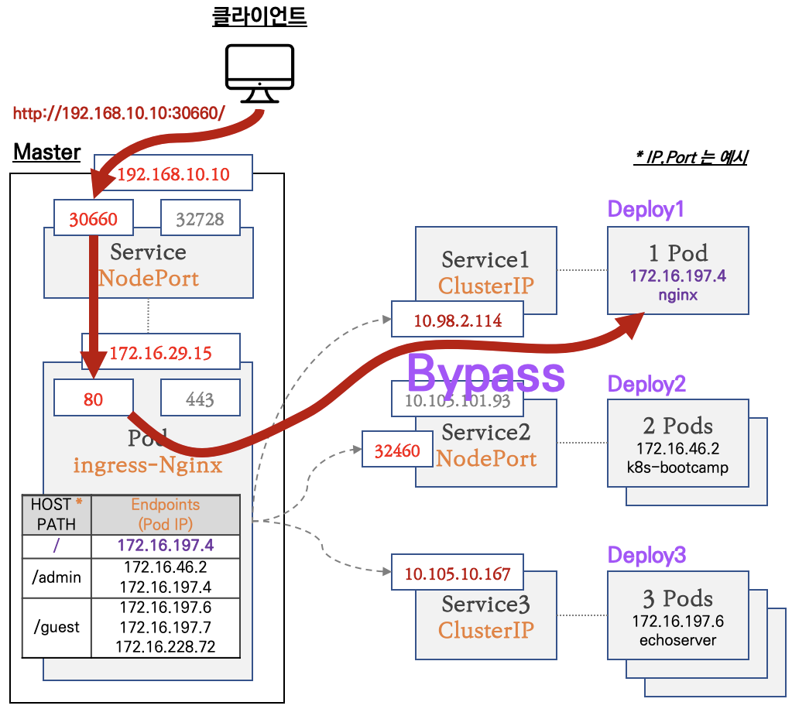

# sub-task : Service and Networking 산출물

[1. Kubernetes Network 동작 원리](#1-pod) 
- [1.1. Pod Network 구조](#1-1-pod-network-구조를-이해하고-내용을-간략히-작성하세요) 
- [1.2. Service Network 구조](#1-2-service-network-구조를-이해하고-내용을-간략히-작성하세요) 
- [1.3. Ingress Network](#1-3-ingress-network-구조를-이해하고-내용을-간략히-작성하세요) 
- [1.4. kube-proxy 역할](#1-4-kube-proxy-역할을-간략히-작성하세요) 
[2. Service](#2-service) 
- [2.1. Service Type 개념](#2-1-다음-service-type에-대해-간략히-작성하세요) 
- [2.2. Servie 생성](#2-2-devops-namespace에서-8080포트로-서비스되는-nginx-pod를-만들고-service를-생성하세요) 
- [2.3. Named Service 구성](#2-3-pod를-이용한-named-service-구성) 
[3. Network Policy](#3-network-policy) 
- [3.1. Selectors](#3-1-network-policy에-대해-간략히-작성하세요) 
- [3.2. 접근 제어](#3-2-다음-behavior-of-to-and-from-selectors-에-대해-간략히-작성하세요) 
[4. Ingress](#4-ingress) 
- [4.1. Ingress 개념](#4-1-ingress에-대해-간략히-작성하세요) 
- [4.2. Ingress 구성](#4-2-다음-조건에-맞는-ingress-를-구성하세요) 
[5. DNS](#5-dns) 
- [5.1. DNS 개념](#5-1-서비스-및-파드용-dns-에-대해-간략히-작성하세요) 
- [5.2. DNS 구성](#5-2-service-and-dns-lookup-구성) 

# 1. Kubernetes Network 동작 원리

## 1-1. Pod Network 구조를 이해하고 내용을 간략히 작성하세요.

### 파드 내부 통신

도커에서는 원래 컨테이너 별로 각각의 veth를 가짐. 근데 쿠버네티스에서는 pause container를 통해 한 파드의 컨테이너들이 동일한 네트워크 인터페이스(veth0)안에서 생성되어 로컬호스트로 통신이 가능하도록 함. (pause container가 부모 컨테이너로 네임스페이스 상속하는 형태)

### 동일 노드 파드간 통신

각 pod는 CNI로 구성된 네트워크 인터페이스를 통하여 고유한 IP주소로 서로 통신할 수 있음.

예를 들어, 왼쪽 파드에서 오른쪽 파드로 통신을 하려고 할 때,

오가 같은 네트워크 네임스페이스의 컨테이너가 아니므로(같은 파드 내 컨테이너가 아님) eth0으로 패킷 전달 -> veth pair로 연결된 노드의 root network namespace로 전달됨. -> bridge로 패킷이 전달되면 -> broadcast가 전송되어 오의 ip 주소를 질의하게 됨. -> 오 pod 인터페이스의 mac 주소가 전달됨 -> iptable에 저장되면 조회하여 패킷을 오 pod로 전달.

### 다른 노드 파드간 통신

pod의 네트워크 정보를 node에서 encapsulation 과정을 거쳐 목적지 node로 전달함(overlay 방식*).

예를 들어 pod1에서 pod3으로 통신이 발생하면 pod1에서 출발할 때의 패킷은 출발지, 목적지 ip가 각각 pod1, pod3의 주소지만, 노드에서 터널을 거치면서 물리적 경로의 인터페이스 정보가 추가됨. 목적지 노드에서 출발지 목적지 ip를 제거하면 pod3에서 pod의 정보만 남은 패킷을 받게됨.

##### ** 오버레이 네트워크

물리적인 네트워크 위에 가상 네트워크를 구축하여 서로 다른 노드에 있는 pod 들이 같은 네트워크에 있는 것처럼 통신할 수 있게 해주는 기술로 CNI 플러그인을 통해 적용됨.

## 1-2. Service Network 구조를 이해하고 내용을 간략히 작성하세요.

pod는 끊임없이 삭제되거나 재생성되기 때문에 서비스(pod)의 앞단에 proxy를 두고 proxy로 연결을 하면 서버들의 목록을 관리하며 현재 동작하는 서버에게 트래픽을 전달.

1. 스스로 내구성이 있어야하며 장애에 대응이 가능해야 함.
2. 트래픽을 전달할 서버 리스트를 보유하고 해당 서버가 정상적으로 동작하는지 확인할 수 있어야 함.

service는 각 pod로 트래픽을 포워딩 해주는 프록시 역할이며 selector를 사용해 트래픽을 전달받을 pod를 결정함.

위와 같은 구조로 파드가 배포되어 있고, 각 노드에 있는 server pod1의 라벨을 셀렉터를 가진 서비스가 존재한다고 할 때 http 요청을 하는 과정은

1. client 파드가 service 이름의 DNS 이름으로 http 요청을 함.
2. coredns가 해당 이름을 serviceIP로 매핑시켜줌.
3. 해당 ip로 요청을 보냄.

더 자세히 보면, 

1. client pod의 veth1에서 목적지 ip를 확인하고 주소를 알지 못하기 때문에 다음 게이트웨이(cbr0)으로 보냄. 
2. 브릿지인 cbr0은 다음 게이트웨이(eth0)으로 패킷을 전달함.
3. 여기서 최상위 게이트웨이로 전달되는 것이 아닌 kube-proxy를 통해 패킷이 포워딩됨.

##### ** IP네트워크(layer3)는 해당 호스트에서 목적지를 찾지 못하면 상위 게이트웨이로 패킷을 보내는 형태로 동작하게 됨.

## 1-3. Ingress Network 구조를 이해하고 내용을 간략히 작성하세요.

### 사전 이해

서비스 네트워크는 실제 네트워크 디바이스에 연결되는 것이 아니라 routing rule에 의해 구성된 가상의 네트워크

우선, 서비스에 가상의 IP를 할당하는 이유는 만약 ClusterIP를 노드의 네트워크 인터페이스에 바인딩한다면 IP가 해당 노드에서만 유효하게 돼서 다른 노드에서는 해당 IP로 접근이 불가능함.
서비스 IP는 모든 노드에서 작동하게 하기 위해 가상으로 처리하여 kube-proxy가 netfilter를 사용하여 ClusterIP로 보내지는 패킷을 낚아채서 healthy pod로 패킷을 보냄.

※ 동일한 IP를 노드마다 등록할 수도 있지만 예를 들어 IP로 요청이 들어오면 해당 IP가 이미 인터페이스에 존재한다고 판단해 로컬로 처리하려고 하고, kube-proxy는 pod로 해당 요청을 전달하려고 해 충돌하거나 패킷의 손실 위험이 있음.

파드의 IP는 인터페이스에 바인딩하는 이유는 서비스는 proxy로 스스로 패킷을 송수신하지 않으나, 파드는 네트워크 통신 주체(endpoint)기 때문에 네트워크 인터페이스에 IP를 할당해야 패킷 송수신이 가능함.

### ingress

일반 서비스는 kube-proxy를 통해 패킷을 전달하는 방식이라면, ingress controller는 불필요한 작업을 줄이기 위해 endpoints 정보를 모니터링하며(이건 서비스를 통해서라고 함.) 패킷을 pod로 직접 전달한다고 함. 대상 서비스의 endpoints를 가져와야 해서 ingress controller에 clusterrole, role이 설정되어 있음.

## 1-4. kube-proxy 역할을 간략히 작성하세요.

### 사전 이해

쿠버네티스에선 리눅스 커널 기능 중 하나인 netfilter와 user space에 존재하는 인터페이스인 iptables를 이용하여 패킷 흐름을 제어함.

** netfilter란 rul-based 패킷 처리 엔진으로 커널 스페이스에 위치하여 모든 패킷의 생명주기를 관찰하며 규칙에 매칭되는 패킷을 발견 시 미리 정의된 action을 수행하는 proxy.
** iptables는 netfilter를 이용하여 chain rule이란 규칙을 지정하여 패킷을 포워딩하도록 네트워크 설정.

### kube-proxy

##### user space 모드

1. kube-proxy가 localhost 인터페이스에서 service 요청을 받기 위해 임의의 포트(10400)를 연다.
2. kube-proxy가 netfilter에게 serviceIP(10.3.241.152:80)로 들어오는 패킷을 자신에게 라우팅 되도록 설정한다.
3. kube-proxy로 들어온 요청을 실제 server pod의 ip:port(10.0.2.2:8080)로 전달한다.

##### iptables 모드

근데 이렇게 하면 모든 패킷을 user space에서 kernel space로 변환해야 하기 때문에 비효율적임. 쿠버네티스 1.2 버전 이후로는 iptables 모드가 생김.
kube-proxy가 직접 proxy의 역할을 수행하지 않고 전부 netfilter에게 위임함.

serviceIP를 확인하고 pod로 전달하는 것은 netfilter가 하고 kube-proxy는 netfilter의 규칙을 알맞게 수정하는 역할을 맡음.

kube-proxy가 apiserver의 정보를 수신하다가 변화를 감지하면 iptables를 업데이트하여 netfilter의 규칙을 최신화함.

ex) service가 새로 생성되면 kube-proxy가 알림을 받고 거기에 맞는 규칙을 생성함.

kubelet을 통해 health check을 하고 문제를 발견하면 apiserver를 통해 proxy에게 알려서 unhealthy pod의 endpoint를 제거함.

하지만 이 방식은 외부에서 들어오는 요청에는 동일하게 적용되지 않고 클러스터 내부의 pod에서 들어오는 요청에 한해서만 위와 같이 동작함.

# 2. Service

## 2-1. 다음 Service Type에 대해 간략히 작성하세요.

### ClusterIP

클러스터 내부에서만 접근 가능한 서비스 유형으로 파드들이 서로 다른 워커노드에 위치해도 통신 가능.

Pod A(client)가 kube-proxy를 통해 트래픽을 Pod B로 전달함. 
PodA의 네트워크 트래픽이 Node1을 나가기 전 kube-proxy의 iptables의 destination NAT에 의해 목적지 주소가 서비스의 clusterIP에서 pod의 clusterIP로 변경됨. PodB가 보낸 응답 트래픽 또한 소스가 PodB의 clusterIp -> servcie의 clusterIP로 변경되어 PodA로 전달됨.

### NodePort

1. NodePort 타입의 서비스가 생성되면 kube-proxy가 각 노드의 eth0 네트워크 인터페이스에 30000-32767 사이의 포트를 임의로 할당함.
2. 할당된 포트로 요청이 들어오면 매핑된 clusterIP로 전달함. 
    NodePort -> ClusterIP -> Pod 이런 흐름처럼 보이지만 실제로는,
    1) NodePort로 패킷이 들어오면
    2) iptables의 DNAT 룰에 의해
    3) ClusterIP + 서비스 포트로 목적지가 변경되고
    4) 다시 kube-proxy가 관리하는 iptables 룰에 의해
    5) pod의 ip와 포트로 전달되는 과정.
    ClusterIP 주소를 가진 네트워크 인터페이스로 라우팅하는 것이 아닌 netfilter 룰에 쓰이는 매핑 key의 역할을 하며 매핑을 통해 kube-proxy가 등록한 룰에 의해 실제 pod IP로 NAT되어 전달되는 것임.

### LoadBalancer

클라이언트가 로드밸런서의 IP로 요청을 보내면 노드 중 하나의 nodeport로 전달함. 나머지는 동일.

그치만 단점이 있는데 path-base routing(L7)이나 virtual host 설정이 불가능하기 때문에 한개의 로드밸런서를 여러 서비스에 연결하는 것이 불가능함. 이런 단점때문에 Ingress가 도입됨.

## 2-2. 'devops' namespace에서 8080포트로 서비스되는 nginx pod를 만들고 Service를 생성하세요.

    kubectl run nginx --image=docker.io/library/nginx:latest --port=8080 -n sy-subtask --dry-run=client -o yaml > nginx.yaml
    kubectl apply -f nginx.yaml
    kubectl expose pod nginx -n sy-subtask --port=8080 --name=internal-sv

### 실행 결과

    ubuntu@qna-cluster-001:~/workspace/sy$ kubectl get pods -n sy-subtask 
    NAME    READY   STATUS    RESTARTS   AGE
    nginx   1/1     Running   0          65s
    ubuntu@qna-cluster-001:~/workspace/sy$ kubectl get svc -n sy-subtask 
    NAME          TYPE        CLUSTER-IP      EXTERNAL-IP   PORT(S)    AGE
    internal-sv   ClusterIP   10.233.63.170   <none>        8080/TCP   19s

## 2-3. Pod를 이용한 Named Service 구성

    apiVersion: v1
    kind: Pod
    metadata:
    creationTimestamp: null
    labels:
        run: nginx
    name: nginx
    namespace: sy-subtask
    spec:
    containers:
    - image: docker.io/library/nginx:latest
        name: nginx
        ports:
        - containerPort: 8080
        name: http // 추가
        resources: {}
    dnsPolicy: ClusterFirst
    restartPolicy: Always
    status: {}

    kubectl apply -f nginx.yaml --force

    kubectl expose pod nginx -n sy-subtask --name=front-end-svc --type=NodePort --target-port=http --port=30080
    
### 실행 결과

    // 파드 조회
    ubuntu@qna-cluster-001:~/workspace/sy$ kubectl apply -f nginx.yaml --force
    pod/nginx configured

    ubuntu@qna-cluster-001:~/workspace/sy$ kubectl get pod nginx -n sy-subtask -o yaml > test.yaml
    ubuntu@qna-cluster-001:~/workspace/sy$ vi test.yaml
    ...
    ports:
    - containerPort: 8080
      name: http
    ...

    // 서비스 조회
    ubuntu@qna-cluster-001:~/workspace/sy$ kubectl describe svc front-end-svc -n sy-subtask 
    Name:                     front-end-svc
    Namespace:                sy-subtask
    Labels:                   run=nginx
    Annotations:              <none>
    Selector:                 run=nginx
    Type:                     NodePort
    IP Family Policy:         SingleStack
    IP Families:              IPv4
    IP:                       10.233.43.96
    IPs:                      10.233.43.96
    Port:                     <unset>  30080/TCP
    TargetPort:               http/TCP
    NodePort:                 <unset>  30615/TCP
    Endpoints:                10.233.90.181:8080

# 3. Network Policy

## 3-1. Network Policy에 대해 간략히 작성하세요.

기본적으로 파드끼리 서로 모든 통신이 가능한 상태인데 DB와 같이 보안이 중요한 파드에 대한 접근을 제어하기 위해(IP 또는 포트 레벨 3/4계층에서) CNI에 의해 network policy를 적용. (파드 생성 시 labels에 명시한 key:value 값을 기준)

네임스페이스 단위 자원으로 네임스페이스 별로 각각 적용해줘야 함.

- pod 또는 namespace 기반 : selector를 사용하여 어떤 트래픽이 selector와 일치하는 파드(to/from)에서 허용되는지 지정함.
- IP 기반 : IP 블록(CIDR 범위)을 기반으로 정의.

### 파드 격리

특정 방향으로 하나 이상의 정책이 허용되면 충돌하지 않고 합집합(or)

- Egress : 파드에서 나가는 연결에 대한 격리 (기본 모든 연결 허용)
- Ingress : 파드로 들어오는 연결에 대한 격리 (기본 모든 연결 허용)

## 3-2. 다음 Behavior of to and from selectors 에 대해 간략히 작성하세요.

    // 예시
    apiVersion: networking.k8s.io/v1
    kind: NetworkPolicy
    metadata:
    name: test-network-policy
    namespace: default
    spec:
    podSelector:
        matchLabels:
        role: db // role=db 라벨을 가진 파드들에 적용됨. {}면 namespace 내 모든 파드에 적용
    policyTypes:
    - Ingress //여기에 명시되면 허용 정책 외엔 모두 차단하는 역할
    - Egress
    ingress:
    - from: // source에 대한 제한
        - ipBlock: //들어오는 ip 블록을 제한하는 역할. 
            cidr: 172.17.0.0/16 // 허용 범위
            except:
            - 172.17.1.0/24 // 얘만 빼고
        - namespaceSelector:
            matchLabels:
            project: myproject // project=myproject 라벨 가진 네임스페이스 허용
        - podSelector:
            matchLabels:
            role: frontend // role=frontend 라벨 가진 파드 허용
        ports:
        - protocol: TCP
        port: 6379 // source나 destination이 어떤 port로 통신할 수 있는지 정의
    egress:
    - to: // destination에 대한 제한
        - ipBlock:
            cidr: 10.0.0.0/24 // 목적지 IP 범위 제한
        ports:
        - protocol: TCP
        port: 5978 // 통신 포트 제한

- podSelector : label 기반으로 해당 파드의 접근을 허용.
- namespaceSelector : label 기반으로 해당 네임스페이스의 파드들의 접근을 허용.
- ipblock : 접근할 수 있는 IP 블록을 제한하는 역할

from 부분에 조건들이 각각 - 로 되어있어서 or로 적용된다고 함. and로 만들고 싶으면 하나의 - 에 해야됨.

    // or
    - namespaceSelector:
        matchLabels:
        project: myproject
    - podSelector:
        matchLabels:
        role: frontend

    // and
    - namespaceSelector:
        matchLabels:
        project: myproject
      podSelector:
        matchLabels:
        role: frontend

## 3-3. 다음 조건에 맞는 NetworkPolicy를 생성하고 접근을 제어해 보세요.

    // poc 파드 배포
    $ kubectl run poc --image=docker.io/library/nginx:latest --port=80 --labels="app=poc"

    $ kubectl describe pod poc
        Name:             poc
        Namespace:        default
        Priority:         0
        Service Account:  default
        Node:             ncp-kpaas-nodepools-w-2hnb/10.0.10.14
        Start Time:       Thu, 10 Jul 2025 13:11:42 +0900
        Labels:           app=poc

    // networkpolicy 정의
    $ vi policy.yaml
        apiVersion: networking.k8s.io/v1
        kind: NetworkPolicy
        metadata:
        name: allow-webfrom-customera
        spec:
        podSelector:
            matchLabels:
            pod: poc
        policyTypes:
        - Ingress
        ingress:
        - from:
            - namespaceSelector:
                matchLabels:
                partition: customera
            ports:
            - protocol: TCP
            port: 80
    
    //실행 결과
    $ kubectl describe networkpolicy allow-webfrom-customera 
        Name:         allow-webfrom-customera
        Namespace:    default
        Created on:   2025-07-10 13:43:14 +0900 KST
        Labels:       <none>
        Annotations:  <none>
        Spec:
        PodSelector:     pod=poc
        Allowing ingress traffic:
            To Port: 80/TCP
            From:
            NamespaceSelector: partition=customera
        Not affecting egress traffic
        Policy Types: Ingress    

 # 4. Ingress

 ## 4-1. Ingress에 대해 간략히 작성하세요.

 ingress란 리버스 프록시를 통해 클러스터 내부 service로 어떻게 패킷을 포워딩 시킬 것인지 명시한 리소스로 한 개의 로드밸런서를 통해 여러 개의 서비스를 연결하여 사용이 가능.
 
 ## 4-2. 다음 조건에 맞는 ingress 를 구성하세요.

    // pod 및 service 배포
    $ kubectl run ingress-nginx --image=docker.io/library/nginx:latest --port=80 -n sy-subtask --expose=true
    $ kubectl run app-nginx --image=docker.io/library/nginx:latest --port=80 -n sy-subtask  --expose=true

    // ingress 설정 파일 생성
    $ kubectl create ingress sy-ingress --rule="test.foo.com/=ingress-nginx:80" -n sy-subtask --dry-run=client -o yaml > ingress.yaml

    // 설정 수정
    apiVersion: networking.k8s.io/v1
    kind: Ingress
    metadata:
        name: sy-ingress
        namespace: sy-subtask
        annotations: // 추가
            nginx.ingress.kubernetes.io/rewrite-target: / 
    spec:
        ingressClassName: nginx // 추가
        rules:
        - host: sy-test.foo.com
            http:
            paths:
            - backend:
                service:
                    name: ingress-nginx
                    port:
                    number: 80
                path: /
                pathType: Prefix
            - path: /app  // 추가
                pathType: Prefix
                backend:
                service:
                    name: app-nginx
                    port:
                    number: 80
    status:
        loadBalancer: {}   

    // 배포 확인
    $ kubectl describe ing -n sy-subtask sy-ingress
        Name:             sy-ingress
        Labels:           <none>
        Namespace:        sy-subtask
        Address:          27.96.156.231
        Ingress Class:    nginx
        Default backend:  <default>
        Rules:
        Host             Path  Backends
        ----             ----  --------
        sy-test.foo.com  
                        /      ingress-nginx:80 (10.233.90.141:80)
                        /app   app-nginx:80 (10.233.90.183:80)
        Annotations:       nginx.ingress.kubernetes.io/rewrite-target: /

### 접속 테스트

◆ ingress-nginx 접속 테스트

    ncloud@ta-redmine:~$ curl http://sy-test.foo.com
    <!DOCTYPE html>
    <html>
    <head>
    <title>Welcome to nginx!</title>

◆ app-nginx 접속 테스트

    ncloud@ta-redmine:~$ curl http://sy-test.foo.com/app
    <!DOCTYPE html>
    <html>
    <head>
    <title>Welcome to nginx!</title>

### 문제 해결

- ACG에 로드밸런서 서브넷 대역을 추가해줘야 health check가 가능함.
- ingress controller의 externalTrafficPolicy 설정이 local로 되어 있어 간헐적으로 서버에 요청이 제대로 전달되지 않는 문제 발생(curl: (52) Empty reply from server)하여 Cluster로 변경함.

# 5. DNS

## 5-1. 서비스 및 파드용 DNS 에 대해 간략히 작성하세요.

### service dns

    // 형식
    <service-name>.<namespace>.svc.cluster.local

### pod dns

    // 형식
    <pod-ip>.<namespace>.pod.cluster.local

## 5-2. Service and DNS Lookup 구성

    // resolver pod & service 생성
    $ kubectl run resolver --image=docker.io/library/nginx:latest --port=80 -n sy-subtask
    $ kubectl expose pod resolver --name=resolver-service -n sy-subtask

    // dns 조회
    kubectl run -it busybox --image=busybox:1.28 --restart=Never -n sy-subtask

    // service 조회
    / # nslookup resolver-service
    Server:    169.254.25.10
    Address 1: 169.254.25.10

    Name:      resolver-service
    Address 1: 10.233.6.100 resolver-service.sy-subtask.svc.cluster.local

    // pod 조회
    / # nslookup resolver
    Server:    169.254.25.10
    Address 1: 169.254.25.10

    nslookup: can't resolve 'resolver'

### 정리

위 예시로 pod와 service를 생성하면, 

1. pod 생성 시 kubelet이 pod 내부 /etc/resolv.conf에 coreDNS 주소를 DNS 서버로 설정함.
2. 서비스가 생성되고 endpoints가 준비되면 coredns가 인메모리 캐시에 저장함. 
3. pod 내부에서 nslookup 수행하면 coreDNS에 도메인을 질의함.
4. coreDNS가 ip 주소를 반환하면 반환한 ip로 통신함.

서비스는 생성될 때 자동으로 A/AAAA 레코드가 생성되지만, 파드는 특정 조건이 갖춰지지 않으면 생성이 되지 않음.

파드는 아래와 같이 조회가 가능함. 

    / # nslookup 10-233-90-188.sy-subtask.pod.cluster.local
    Server:    169.254.25.10
    Address 1: 169.254.25.10

    Name:      10-233-90-188.sy-subtask.pod.cluster.local
    Address 1: 10.233.90.188 10-233-90-188.resolver-service.sy-subtask.svc.cluster.local