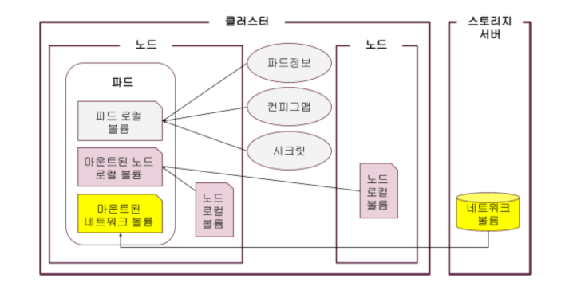
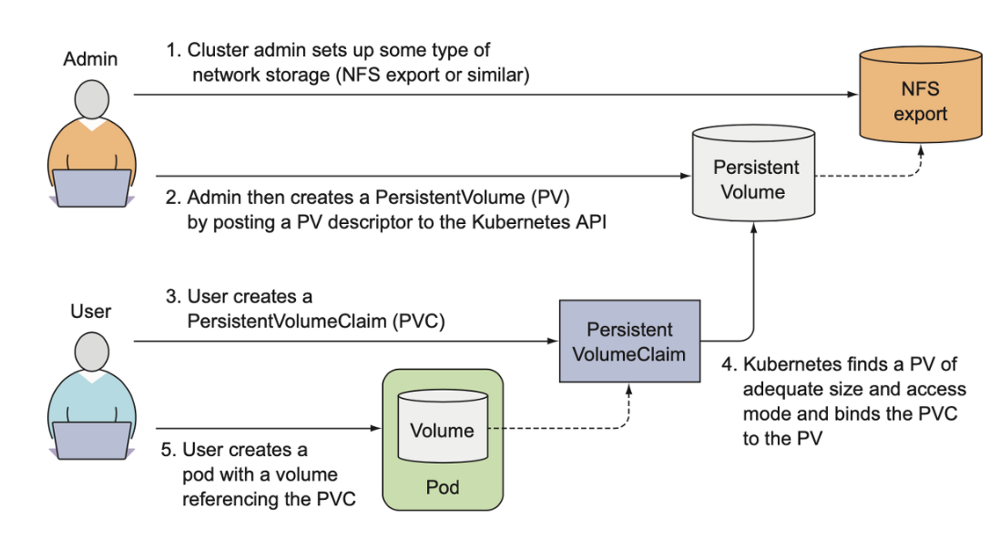
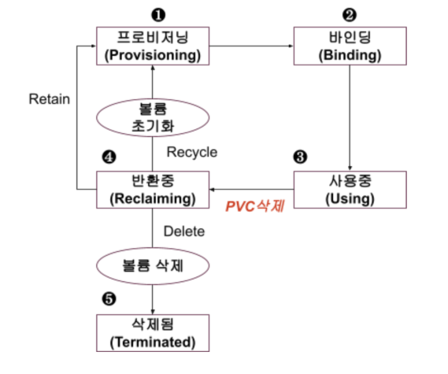

# sub-task : Storage 산출물

[1. Kubernetes Stroage](#1-kubernetes-stroage) 
- [1.1. Kubernetes Stroage 개념](#1-1-kubernetes-stroage-구조를-이해하고-내용을-간략히-작성하세요) 
[2. emptyDir](#2-emptydir) 
- [2.1. emptyDir 개념](#2-1-emptydir-volume에-대해-간략히-작성하세요) 
- [2.2. emptyDir Pod 배포](#2-2-emptydir-volume을-공유하는-multi-pod-구성) 
[3. HostPath](#3-hostpath) 
- [3.1. HostPath 개념](#3-1-hostpath-volume에-대해-간략히-작성하세요) 
- [3.2. HostPath Volume 구성](#3-2-hostpath-volume-구성) 
[4. PV & PVC](#4-pvpersistent-volume--pvcpersistent-volume-claim) 
- [4.1. PV 개념](#4-1-pv에-대해-간략히-작성하세요) 
- [4.2. PVC 개념](#4-2-pvc에-대해-간략히-작성하세요) 
- [4.3. PersistentVolume 배포](#4-3-다음-조건에-맞는-persistentvolume-을-생성하세요) 
- [4.4. PVC Pod 구성](#4-4-pvc를-사용하는-애플리케이션-pod-구성) 

# 1. Kubernetes Stroage

## 1-1. Kubernetes Stroage 구조를 이해하고 내용을 간략히 작성하세요.

- 수시로 제거되는 컨테이너의 특성상 외부 볼륨이 필수적.
- 크게 파드 로컬 볼륨, 노드 로컬 볼륨, 네트워크 볼륨(ceph)으로 나뉨.
- 파드 내에 볼륨을 마운트 함으로써 어떤 유형의 볼륨이든 파드 내부의 파일 시스템인 것처럼 사용이 가능하게 함.

# 2. emptyDir

## 2-1. emptyDir Volume에 대해 간략히 작성하세요.

pod와 생애주기를 같이 하며 컨테이너끼리 공유가 가능한 임시 볼륨

## 2-2. emptyDir Volume을 공유하는 multi-pod 구성

    // deployment 생성
    $ kubectl create deployment weblog --image=docker.io/library/nginx:1.17 -n sy-subtask --dry-run=client -o yaml > weblog.yaml

    // 파일 수정
    ...
        template:
            metadata:
            creationTimestamp: null
            labels:
                app: weblog
            spec:
            containers:
            - image: docker.io/library/nginx:1.17
                name: web-container
                volumeMounts: // 추가
                - mountPath: /var/log/nginx
                name: empty-dir
            - name: log-container // 추가
                image: busybox
                command: ["/bin/sh", "-c", "tail -n+1 -f /data/access.log"]
                volumeMounts:
                - mountPath: /data
                name: empty-dir
                readOnly: true
            volumes: // 추가
            - name: empty-dir
                emptyDir: {}
    ...

    // 실행 결과
    ...
    Mounts:
      /var/log/nginx from empty-dir (rw)
      /var/run/secrets/kubernetes.io/serviceaccount from kube-api-access-k6jq5 (ro)
    ...
    Mounts:
        /data from empty-dir (ro)
        /var/run/secrets/kubernetes.io/serviceaccount from kube-api-access-k6jq5 (ro)
    Conditions:
    Type                        Status
    PodReadyToStartContainers   True 
    Initialized                 True 
    Ready                       True 
    ContainersReady             True 
    PodScheduled                True 
    Volumes:
    empty-dir:
        Type:       EmptyDir (a temporary directory that shares a pod's lifetime)
    ...

# 3. HostPath

## 3-1. HostPath Volume에 대해 간략히 작성하세요.

호스트 노드의 파일 시스템과 pod의 파일을 연결하는 볼륨 타입

## 3-2. HostPath Volume 구성

    // daemonset 생성
    apiVersion: apps/v1
    kind: DaemonSet
    metadata:
    name: fluentd
    spec:
    selector:
        matchLabels:
        name: fluentd
    template:
        metadata:
        labels:
            name: fluentd
        spec:
        containers:
        - name: fluentd
            image: fluentd
            volumeMounts:
            - name: docker-container
            mountPath: /var/lib/docker/containers
            - name: host-dir
            mountPath: /var/log
        volumes:
        - name: docker-container
            hostPath:
            path: /var/lib/docker/containers
            type: Directory
        - name: host-dir
            hostPath:
            path: /var/log
            type: Directory

    // 배포 확인
    ...
    Pod Template:
    Labels:  name=fluentd
    Containers:
    fluentd:
        Image:        fluentd
        Port:         <none>
        Host Port:    <none>
        Environment:  <none>
        Mounts:
        /var/lib/docker/containers from docker-container (rw)
        /var/log from host-dir (rw)
    Volumes:
    docker-container:
        Type:          HostPath (bare host directory volume)
        Path:          /var/lib/docker/containers
        HostPathType:  Directory
    host-dir:
        Type:          HostPath (bare host directory volume)
        Path:          /var/log
        HostPathType:  Directory
    ...

# 4. PV(Persistent Volume) & PVC(Persistent Volume Claim)

## 4-1. PV에 대해 간략히 작성하세요.

데이터를 저장할 볼륨으로 볼륨이 생성되고 이를 클러스터에 등록한 것

### pv lifecycle

### 개념 정리

- provisioning : pv에 정의된 대로 물리 볼륨이 공급되는 단계
- binding : pv와 pvc가 연결되는 단계
- storageclass : pv는 미리 생성해놓고 요청이 들어올 때마다 할당되는 구조인데 cloud 환경에서는 쓰지 않는 자원을 미리 선점할 필요가 없음. volume에 대한 요건(사이즈, ssd, disk, type)만 정의하고 요청이 들어오면 자동으로 생성
- ReclaimPolicy : pv와 바인딩된 pvc를 삭제하면 status가 released로 변경됨. 이때 pv와 연결되어 있떤 디스크 내부의 파일을 어떻게 처리할건지 결정하는 설정.
- Retain : pvc가 삭제되어도 실제 파일을 삭제하지 않는 정책. 중요한 데이터는 retain으로 데이터를 유지하고 pvc를 삭제하기 전에 수동으로 불필요한 데이터를 삭제.

## 4-2. PVC에 대해 간략히 작성하세요.

필요한 저장공간 등 요청사항을 기술한 명세로 pv에 전달하는 요청

## 4-3. 다음 조건에 맞는 PersistentVolume 을 생성하세요.

    // pv 생성
    apiVersion: v1
    kind: PersistentVolume
    metadata:
    name: pv001
    spec:
    capacity:
        storage: 1Gi
    accessModes:
        - ReadWriteMany
    persistentVolumeReclaimPolicy: Retain
    hostPath:
        path: /tmp/app-config

    // 생성 확인
    $ kubectl get pv
        NAME                                       CAPACITY   ACCESS MODES   RECLAIM POLICY   STATUS      CLAIM           STORAGECLASS      VOLUMEATTRIBUTESCLASS   REASON   AGE
        pv001                                      1Gi        RWX            Retain           Available                                     <unset>                          5s

## 4-4. PVC를 사용하는 애플리케이션 Pod 구성

### stoargeclass & pvc 배포

    // storageclass 생성
    $ kubectl get storageclass cp-storageclass -o yaml > storage.yaml

    // app-hostpath-sc 생성
    allowVolumeExpansion: false
    apiVersion: storage.k8s.io/v1
    kind: StorageClass
    metadata:
    name: app-hostpath-sc
    provisioner: cp-nfs-provisioner
    reclaimPolicy: Retain
    volumeBindingMode: Immediate

    // pvc 생성
    apiVersion: v1
    kind: PersistentVolumeClaim
    metadata:
    name: pv-volume
    spec:
    accessModes:
        - ReadWriteMany
    resources:
        requests:
        storage: 10Mi
    storageClassName: app-hostpath-sc

    // 생성 확인
    $ kubectl get pvc -n sy-subtask 
    NAME        STATUS   VOLUME                                     CAPACITY   ACCESS MODES   STORAGECLASS      VOLUMEATTRIBUTESCLASS   AGE
    pv-volume   Bound    pvc-12ae4fa8-1025-43fc-8257-5fad595db2aa   10Mi       RWX            app-hostpath-sc   <unset>                 4s

### pod 배포

    // pod 생성
    $ kubectl run web-server-pod --image=docker.io/library/nginx:latest --dry-run=client -o yaml > web-server.yaml

    // volume 추가
    apiVersion: v1
    kind: Pod
    metadata:
    creationTimestamp: null
    labels:
        run: web-server-pod
    name: web-server-pod
    spec:
    containers:
    - image: docker.io/library/nginx:latest
        name: web-server-pod
        volumeMounts: // 추가
        - name: html
        mountPath: /usr/share/nginx/html
    volumes: // 추가
    - name: html
        persistentVolumeClaim:
        claimName: pv-volume
    dnsPolicy: ClusterFirst
    restartPolicy: Always
    status: {}

    // 배포 확인
    $ kubectl describe pod web-server-pod -n sy-subtask
    ...
        Mounts:
        /usr/share/nginx/html from html (rw)
        /var/run/secrets/kubernetes.io/serviceaccount from kube-api-access-h4js6 (ro)
                True 
    Volumes:
    html:
        Type:       PersistentVolumeClaim (a reference to a PersistentVolumeClaim in the same namespace)
        ClaimName:  pv-volume
        ReadOnly:   false
    ...